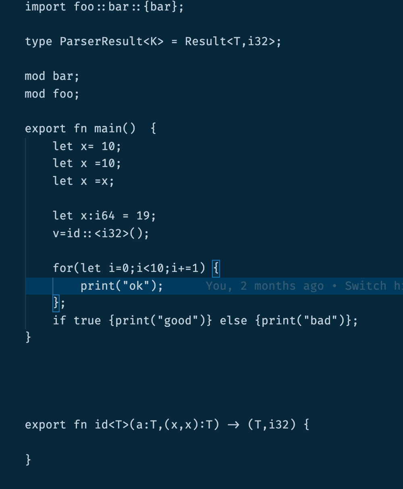
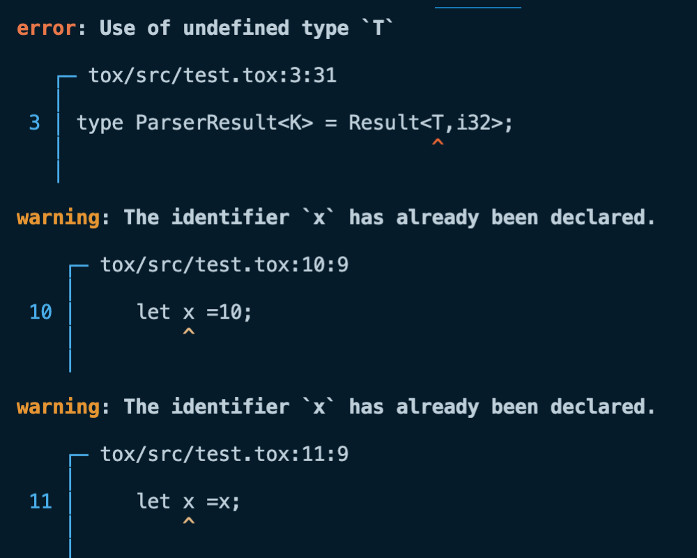
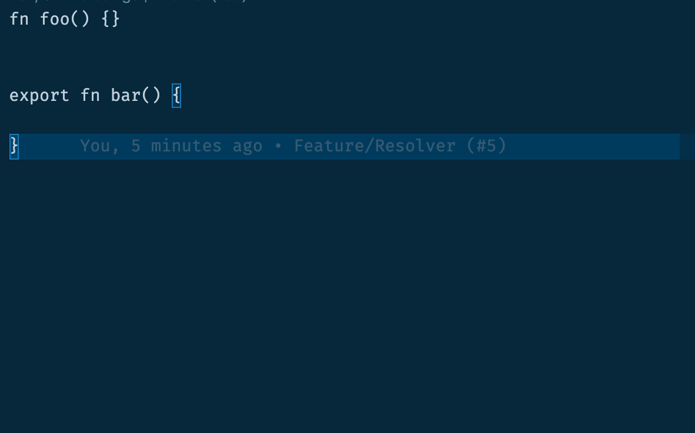

# Tox


[](https://github.com/lapz/tox-rewrite)
<br />
This is the new experimental version of Tox.I've been working on this slowly but I do have a working lexer plus parser and I've started on semantic analysis.

It's built using salsa and rowan and codespan. The design is inspired by rust-analyzer along with other projects.

## Example Program

```ts
fn fib(n:int) -> int {
    if (n < 2)
      return n;
    return fib(n - 2) + fib(n - 1);
}
```

A simple example that makes of uses of the classes

```rust
class Toggle {
    state:bool;

    fn value() -> bool {
      return this.state;
    }

    fn activate() -> Toggle {
      this.state = !this.state;
      return this;
    }
}

fn main() {
  var toggle  = Toggle{state:true};

  print toggle.activate().value();

  print toggle.activate().value();
}
```

## Screenshots





## TODO

- [x] Error when type is defined multiple times
- [x] Add resolve imports to ctx
- [x] Error when a function is used as a type
- [x] Error on duplicate pattern bindings in the same statement
- [x] Warn on unused pattern variable
- [x] Lower structural and struct methods
- [x] Lower enums
- [x] Resolve enums
- [x] Resolve external imports
- [x] Lower field access
- [x] Resolve class field access
- [x] Lower class literal
- [x] Resolve class literal
- [x] Infer types
- [] Codegen
- [] Finish of the VM
- [] Add support for closures

## Build

Generate the ast

```bash
cargo run -p=tools -- -s -g=syntax/src/grammer.ron -t=syntax/src/ast.rs.tera
```

## Resources

- [rust](https://github.com/rust-lang/rust)
- [plank](https://github.com/jDomantas/plank)
- [lox](http://www.craftinginterpreters.com)
- [menhir-lang](https://github.com/GeorgeKT/menhir-lang)
- [minicom](https://github.com/agatan/minicom)
- [tiger-rs](https://github.com/antoyo/tiger-rs)
- [Kaleidoscope](https://llvm.org/docs/tutorial/index.html)
- [kaleidoscope-rs](https://github.com/BookOwl/kaleidoscope-rs)
- [inko](https://gitlab.com/yorickpeterse/inko)
- [NovaLang](https://github.com/boomshroom/NovaLang)
- [gluon](https://github.com/gluon-lang/gluon)
- [dora](https://github.com/dinfuehr/dora)
- Modern Compiler Implementation in [ML](http://www.cs.princeton.edu/~appel/modern/ml/), [java](http://www.cs.princeton.edu/~appel/modern/java/) and [C](https://www.cs.princeton.edu/~appel/modern/c/)
- [Developing Statically Typed Programming Language](http://blog.mgechev.com/2017/08/05/typed-lambda-calculus-create-type-checker-transpiler-compiler-javascript/)
- [/r/ProgrammingLanguages](https://www.reddit.com/r/ProgrammingLanguages/)
- [awesome-compilers](https://github.com/aalhour/awesome-compilers)
